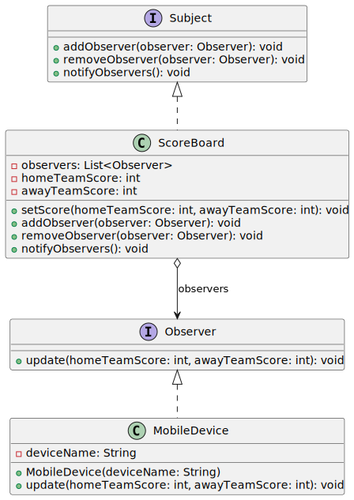

# Observer Pattern
---

### Diagrama de classes do exemplo:

# Diagrama UML do Observer Pattern



Claro! Vamos aprofundar os conceitos do padrão Observer e como ele é implementado no exemplo do placar de futebol.

### Conceitos Fundamentais

1. **Padrão Observer**:
   - **Definição**: O padrão Observer é um padrão de design comportamental que define uma dependência um-para-muitos entre objetos. Quando o estado de um objeto muda, todos os seus dependentes são automaticamente notificados e atualizados. Isso promove um baixo acoplamento entre o objeto que muda de estado (o "subject" ou "observável") e os objetos que reagem a essa mudança (os "observers" ou "observadores").
   - **Motivação**: Imagine um sistema onde múltiplos componentes precisam ser informados sobre uma mudança de estado em outro componente. Em vez de cada componente perguntar repetidamente se algo mudou (o que seria ineficiente), o padrão Observer permite que o componente afetado (o subject) notifique automaticamente todos os componentes interessados (os observers) sobre qualquer mudança.

2. **Aplicação no Contexto de Futebol**:
   - **Subject (Placar)**: O placar (`ScoreBoard`) é o objeto que detém o estado do jogo, especificamente os pontos dos times da casa e visitante. Esse objeto é responsável por notificar todos os observadores (por exemplo, dispositivos móveis) quando o placar é atualizado.
   - **Observers (Dispositivos Móveis)**: São os dispositivos que "observam" o placar e são notificados sempre que o placar muda. Nesse exemplo, os dispositivos móveis (`MobileDevice`) mostram o placar em tempo real.

### Implementação Passo a Passo

#### 1. Interface `Observer`

A interface `Observer` define um contrato para todos os observadores. Ou seja, qualquer classe que queira "observar" o placar precisa implementar esta interface e, especificamente, o método `update`.

```java
public interface Observer {
    void update(int homeTeamScore, int awayTeamScore);
}
```

- **Método `update`**: Este método será chamado pelo placar (`ScoreBoard`) sempre que houver uma mudança nos pontos. Os parâmetros `homeTeamScore` e `awayTeamScore` representam os pontos dos times da casa e visitante, respectivamente.

#### 2. Interface `Subject`

A interface `Subject` define os métodos que o placar deve implementar para gerenciar seus observadores.

```java
import java.util.ArrayList;
import java.util.List;

public interface Subject {
    void addObserver(Observer observer);
    void removeObserver(Observer observer);
    void notifyObservers();
}
```

- **Método `addObserver`**: Permite que um observador seja adicionado à lista de observadores.
- **Método `removeObserver`**: Permite que um observador seja removido da lista.
- **Método `notifyObservers`**: Notifica todos os observadores sobre uma mudança no estado.

#### 3. Classe `ScoreBoard` (Placar)

Esta classe implementa a interface `Subject` e gerencia a lista de observadores. Ela é responsável por manter o estado do placar e notificar os observadores quando esse estado muda.

```java
public class ScoreBoard implements Subject {
    private List<Observer> observers;
    private int homeTeamScore;
    private int awayTeamScore;

    public ScoreBoard() {
        observers = new ArrayList<>();
    }

    public void setScore(int homeTeamScore, int awayTeamScore) {
        this.homeTeamScore = homeTeamScore;
        this.awayTeamScore = awayTeamScore;
        notifyObservers();
    }

    @Override
    public void addObserver(Observer observer) {
        observers.add(observer);
    }

    @Override
    public void removeObserver(Observer observer) {
        observers.remove(observer);
    }

    @Override
    public void notifyObservers() {
        for (Observer observer : observers) {
            observer.update(homeTeamScore, awayTeamScore);
        }
    }
}
```

- **Atributos**:
  - `observers`: Lista de objetos que implementam a interface `Observer`. Estes são os observadores que serão notificados.
  - `homeTeamScore` e `awayTeamScore`: Pontuações dos times da casa e visitante.

- **Método `setScore`**: Atualiza o placar e chama o método `notifyObservers` para notificar todos os observadores sobre a mudança.
- **Método `notifyObservers`**: Itera sobre a lista de observadores e chama o método `update` de cada um, passando os novos valores do placar.

#### 4. Classe `MobileDevice` (Dispositivo Móvel)

Esta classe implementa a interface `Observer` e representa um dispositivo que exibe o placar atualizado.

```java
public class MobileDevice implements Observer {
    private String deviceName;

    public MobileDevice(String deviceName) {
        this.deviceName = deviceName;
    }

    @Override
    public void update(int homeTeamScore, int awayTeamScore) {
        System.out.println(deviceName + " - Placar atualizado: " + homeTeamScore + " x " + awayTeamScore);
    }
}
```

- **Atributos**:
  - `deviceName`: Nome do dispositivo, usado para identificar qual dispositivo está sendo atualizado.
  
- **Método `update`**: Exibe uma mensagem no console com o nome do dispositivo e o placar atualizado.

#### 5. Classe `Main`

Finalmente, a classe `Main` conecta tudo isso. Criamos uma instância do placar, adicionamos observadores e simulamos atualizações no placar.

```java
public class Main {
    public static void main(String[] args) {
        // Criação do placar
        ScoreBoard scoreBoard = new ScoreBoard();

        // Criação dos observadores
        MobileDevice phone1 = new MobileDevice("Celular 1");
        MobileDevice phone2 = new MobileDevice("Celular 2");

        // Adicionando os observadores ao placar
        scoreBoard.addObserver(phone1);
        scoreBoard.addObserver(phone2);

        // Simulando mudanças no placar
        scoreBoard.setScore(1, 0);  // Time da casa marca um gol
        scoreBoard.setScore(1, 1);  // Time visitante empata
    }
}
```

### Fluxo de Execução

1. **Criação do `ScoreBoard`**:
   - O placar é inicializado e uma lista de observadores é criada.

2. **Criação de `MobileDevice`**:
   - Dois dispositivos móveis são criados (`phone1` e `phone2`), representando os observadores.

3. **Adição dos Observadores ao Placar**:
   - Os dispositivos móveis são adicionados ao placar usando o método `addObserver`.

4. **Atualização do Placar**:
   - O placar é atualizado com `scoreBoard.setScore(1, 0)`. Isso altera o estado interno do placar e aciona uma notificação para todos os observadores.
   - Cada dispositivo móvel recebe a notificação e exibe o novo placar.

### Vantagens do Padrão Observer

- **Baixo Acoplamento**: O `ScoreBoard` (subject) não precisa saber detalhes sobre os dispositivos que observam o placar. Ele apenas notifica os observadores. Isso facilita a adição ou remoção de observadores sem modificar o código do `ScoreBoard`.
  
- **Flexibilidade**: Novos tipos de observadores podem ser adicionados sem mudar a implementação do `ScoreBoard`, desde que implementem a interface `Observer`.

- **Escalabilidade**: Vários observadores podem ser registrados para receber atualizações, o que torna o sistema escalável.

Este exemplo mostra como o padrão Observer pode ser utilizado para criar sistemas reativos e desacoplados, onde múltiplos componentes podem reagir automaticamente a mudanças de estado em outros componentes, sem que haja uma dependência rígida entre eles.