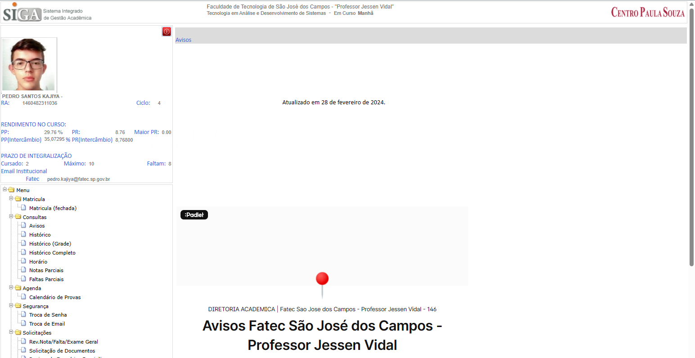
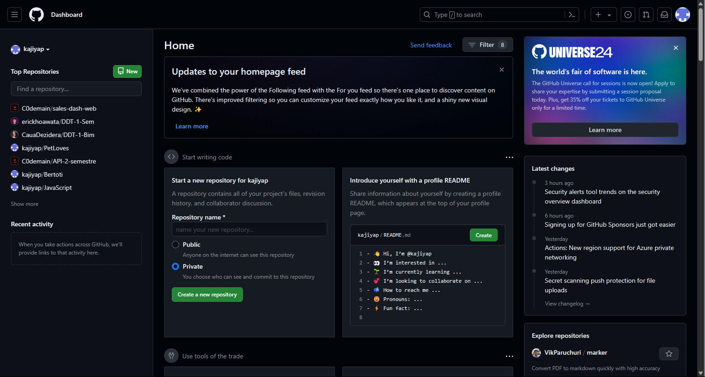
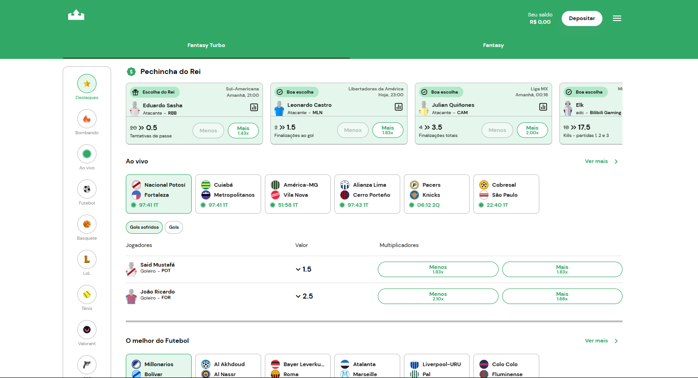
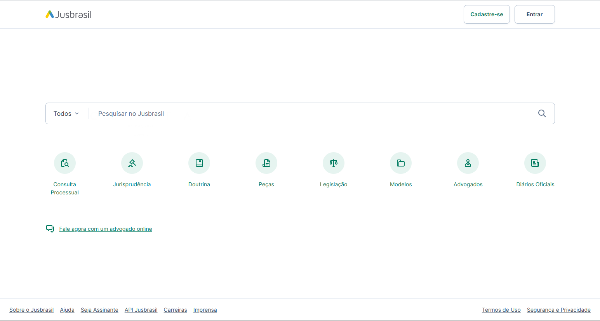
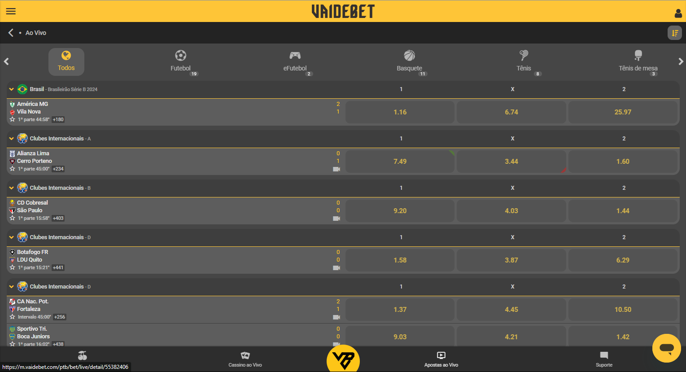
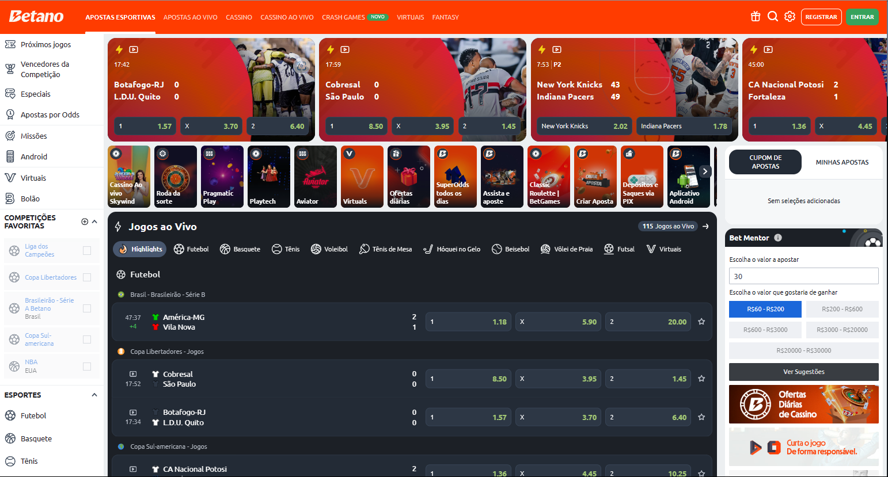
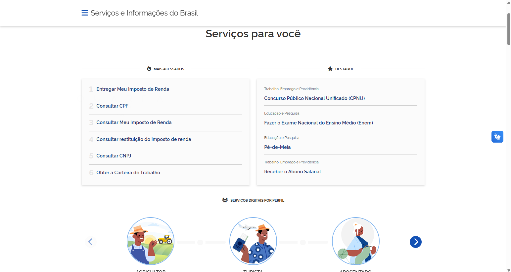

## Positivos

**SIGA** - _Reconhecimento em vez de recordação:_ As informações necessárias para usar o design (por exemplo, rótulos de campo ou itens de menu) devem ser visíveis ou facilmente recuperáveis ​​quando necessário.

**SIGA** - _Design estético e minimalista:_ Cada unidade extra de informação em uma interface compete com as unidades relevantes de informação e diminui sua visibilidade relativa.

**ClickJogos** - _Flexibilidade e eficiência de uso:_ Atalhos - ocultos de usuários novatos - podem acelerar a interação para o usuário especialista, de modo que o design possa atender a usuários inexperientes e experientes

**ClickJogos** - _Design estético e minimalista:_ Cada unidade extra de informação em uma interface compete com as unidades relevantes de informação e diminui sua visibilidade relativa.

**GitHub** - _Design estético e minimalista:_ Cada unidade extra de informação em uma interface compete com as unidades relevantes de informação e diminui sua visibilidade relativa.

**Rei do Pitaco** - _Design estético e minimalista:_ Cada unidade extra de informação em uma interface compete com as unidades relevantes de informação e diminui sua visibilidade relativa.

**JusBrasil** - _Design estético e minimalista:_ Cada unidade extra de informação em uma interface compete com as unidades relevantes de informação e diminui sua visibilidade relativa.

**JusBrasil** - _Correspondência entre o sistema e o mundo real:_ O sistema deve falar a mesma linguagem que o usuário, usando palavras, frases, imagens e conceitos familiares ao usuário

## Negativos

**vaidebet** - _Design estético e minimalista:_ Cada unidade extra de informação em uma interface compete com as unidades relevantes de informação e diminui sua visibilidade relativa.

**vaidebet** - _Controle e liberdade do usuário:_ Os usuários costumam realizar ações por engano. Eles precisam de uma “saída de emergência” claramente marcada para sair da ação indesejada sem ter que passar por um processo extenso.

**Betano** - _Design estético e minimalista:_ Cada unidade extra de informação em uma interface compete com as unidades relevantes de informação e diminui sua visibilidade relativa.

**Gov.br** - _Prevenção de erros:_ É melhor prevenir um erro do que ter que corrigi-lo depois. Elimine condições propensas a erros ou verifique-as e apresente aos usuários uma opção de confirmação antes de prosseguir2.

**Gov.br** - _Design estético e minimalista:_ Cada unidade extra de informação em uma interface compete com as unidades relevantes de informação e diminui sua visibilidade relativa.

